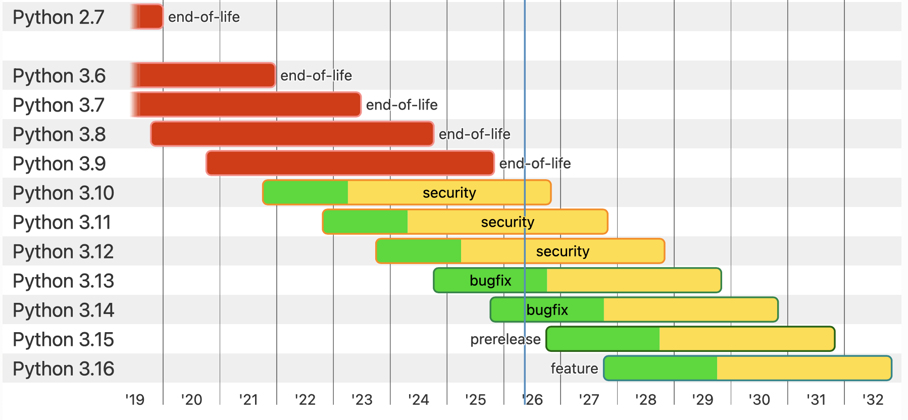

## Instalando Python

{: .no_toc }

<details open markdown="block">
  <summary>
    Table of contents
  </summary>
  {: .text-delta }
- TOC
{:toc}
</details>

**DESCRIPCION**

Este documento explica cómo instalar Python. 

En esta lección:

- instalar python3 en Linux o MacOS 

**DEPENDENCIAS**

ninguna

**REQUIREMENTO**

Sistema Ubuntu o MacOS. <br>
Algunos mandos requieren privilegios elevados.

**ADVERTENCIAS**

ninguna.

## Ambiente de trabajo

En esta lección usamos el sistema operativo Ubuntu.

```bash
-> lsb_release -a
Distributor ID:	Ubuntu
Description:	Ubuntu 24.04.4 LTS
Release:	24.04
Codename:	noble
```

También trabajamos en un sistema MacOS

```bash
-> system_profiler SPSoftwareDataType | grep "System Version"
System Version: macOS 26.2 (25C56)
```

## Versiones activas de Python

Para más información visita la [Guía para desarrolladores de Python](https://devguide.python.org/versions/#versions) para estar informado y decidir la version que deseas instalar.



## Instalación manual de Python en Ubuntu

{: .highlight }
Python3 está disponible por defecto en Ubuntu 24.04.

Python3 está disponible por defecto en Ubuntu 24.04. Pero, si quieres instalar una versión manualmente, ejecuta los comandos a continuación.

```bash
sudo apt-get install software-properties-common
sudo add-apt-repository ppa:deadsnakes/ppa
sudo apt-get update
sudo apt-get install python3 python3-dev
```

## Instalación de Python en MacOS

En Macos, puedes instalar de dos maneras:

1. usando el PKG oficial en Python de 'python.org' 
2. usando homebrew

Elige un método de instalación y mantente fiel a él.

{: .warning }
Si quieres un instalador `python.org`, instala desde `python.org`; pondrá un **Framework** en `/Library/Frameworks` y enlaces simbólicos en `/usr/local/bin`, pero puede entrar en conflicto con los enlaces simbólicos caseros. Evita usar ambos métodos al mismo tiempo en el mismo sistema.

### MacOS :: Instalación de Python usando PKG Download

Ve al [Sitio de Bajar Python]([https://www.python.org/downloads/) para descargar la última versión de macOS. 

Todas las versiones de MacOS están listadas en el [Sitio de Bajar Python](https://www.python.org/downloads/macos/). 

Al hacer clic en una selección, descargas un archivo como tal como `python-3.14.5-macos11.pkg`.

Haz doble clic en el archivo y el diálogo de instalación empieza a mostrar varios pasos:

- Introduction (introducción)
- Read Me (LeerMe)
- License (Licencia)
- Destination Select (Selección De Destino)
- Installation (Instalación)
- Summary (Resumen)

Debes aceptar la licencia cuando aparezca.

La instalación ocupa unos 200MB de espacio en disco. El instalador oficial de macOS de python.org (.pkg) instala Python bajo `/Library/Frameworks/Python.framework` y coloca ejecutables y scripts en `/usr/local/bin` (enlaces simbólicos a los binarios del framework). Caminos clave:

Raíz del marco:

``` bash
/Library/Frameworks/Python.framework/Versions/
```

(e.g., /Library/Frameworks/Python.framework/Versions/3.11)

Ejecutable principal (binario real):

```bash
/Library/Frameworks/Python.framework/Versions//bin/python3
```

Enlaces simbólicos orientados al usuario:

```bash
/usr/local/bin/python3
/usr/local/bin/python3.
/usr/local/bin/pip3
/usr/local/bin/idle3
/usr/local/bin/pyvenv
```

Site-packages:

```bash
/Library/Frameworks/Python.framework/Versions//lib/python./site-packages
```

Archivos de control (recibos):

```bash
/var/db/receipts/ (installer receipts)
```

### Macos :: Instalando Python con Homebrew

Instala Python:

```bash
# actualizar brew
brew update

#instalar python
brew install python
```

Revisa la instalación de Python

```bash
brew list --formula | grep -E '^python(@|$|[0-9])'
```

Consulta el estado del paquete casero:

```bash
brew info python
```

Comprueba qué ejecutables de python ofrece Homebrew:

```bash
ls -l $(brew --prefix)/bin | grep -E '(^|/)python'
```

Verificar versión en tiempo de ejecución:

```bash
which python3

python3 --version
```

Cuando instalas con Homebrew en MacOS, ves algo como esto:

```bash
-> ls -l /usr/local/bin/python3*
lrwxr-xr-x 1 devuser admin 43 Jul 30  2023 /usr/local/bin/python3.9 -> '../Cellar/python@3.9/3.9.17_1/bin/python3.9'*
lrwxr-xr-x 1 devuser admin 50 Jul 30  2023 /usr/local/bin/python3.9-config -> '../Cellar/python@3.9/3.9.17_1/bin/python3.9-config'*
```

Eso apunta a la ubicación del Cellar que se muestra aquí:

```bash
-> ls -l /usr/local/Cellar/python@3.9/3.9.17_1/bin/
total 0
lrwxr-xr-x 1 devuser admin 56 Jun  6  2023 2to3-3.9 -> ../Frameworks/Python.framework/Versions/3.9/bin/2to3-3.9*
lrwxr-xr-x 1 devuser admin 55 Jun  6  2023 idle3.9 -> ../Frameworks/Python.framework/Versions/3.9/bin/idle3.9*
lrwxr-xr-x 1 devuser admin 56 Jun  6  2023 pydoc3.9 -> ../Frameworks/Python.framework/Versions/3.9/bin/pydoc3.9*
lrwxr-xr-x 1 devuser admin 57 Jun  6  2023 python3.9 -> ../Frameworks/Python.framework/Versions/3.9/bin/python3.9*
lrwxr-xr-x 1 devuser admin 64 Jun  6  2023 python3.9-config -> ../Frameworks/Python.framework/Versions/3.9/bin/python3.9-config*
```

Hablamos sobre cómo usar Homebrew en MacOS en otro artículo

## Conclusion

Este proceso mostró cómo crear un entorno local de Python listo para su desarrollo completo. Podemos escribir y ejecutar código. Instala módulos adicionales de python para ampliar su funcionalidad. Podemos experimentar creando más de un entorno virtual y adaptarlo a un caso de uso específico.

## Referencias

### Glossary De Comandos

python3
: El binario estándar de Python

pip3
: Utilidad para gestionar módulos de Python

### Referencias útiles

Documentación oficial:

- [Python Sitio Oficial](https://www.python.org/doc/)
- [Python Docs](https://docs.python.org/)
- [Cómo configurar un entorno de desarrollo para Python en Ubuntu](https://documentation.ubuntu.com/ubuntu-for-developers/howto/python-setup/)

Aprender Python en español:

- [Python Intermedio](https://python-intermedio.readthedocs.io/es/latest/)
- [Python para Todos](https://es.py4e.com/lessons)

[Return to main page]({{site.baseurl}}/)