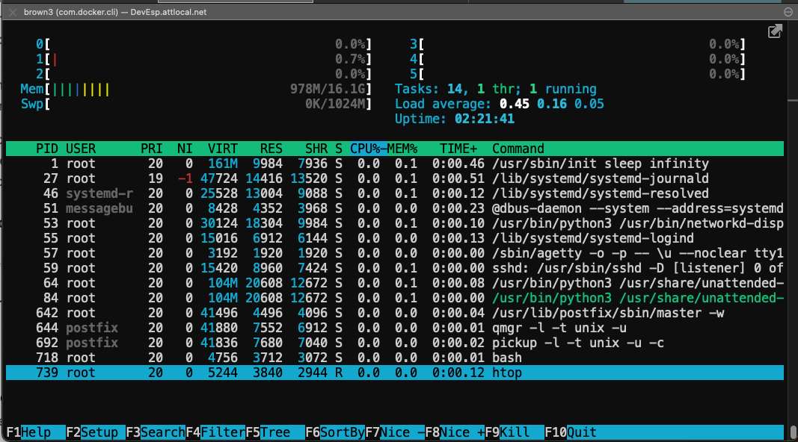
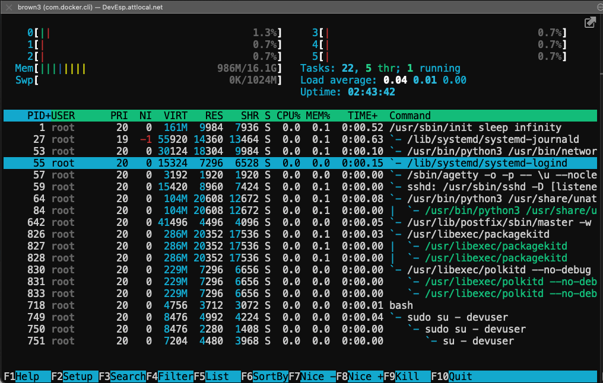

# Visualizar Procesos

{: .no_toc }

<details open markdown="block">
  <summary>
    Table of contents
  </summary>
  {: .text-delta }
- TOC
{:toc}
</details>

---

## Rastrear y Monitorear Procesos

En Ubuntu contamos con tres comandos básicos y fácil de usar para ver los procesos activos.
- ps: muestra los procesos en forma de lista
- pstree: muestra los procesos en forma de árbol con dependencias
- htop: muestra una vista dinámica en una terminal ASCII

## Utilidades Para Monitorear Procesos

Hay varias utilidades disponibles en la linea de comandos para visualizar los procesos y sub-procesos activos en el sistema.

> El uso de estas utilidades asiste en la identificación de problemas de uso eficiente de CPU y memoria. 

### top
El comando `top` muestra la actividad del sistem.<br>
Aqui usamos la bandera `-n` con el valor `1` para mostrar un vista estática de los procesos que estan corriendo.
```bash
-> top -n 1
top - 17:32:41 up 5 days, 18:43,  0 users,  load average: 0.00, 0.00, 0.00
Tasks:  20 total,   1 running,  19 sleeping,   0 stopped,   0 zombie
%Cpu(s):  0.0 us,  0.0 sy,  0.0 ni,100.0 id,  0.0 wa,  0.0 hi,  0.0 si,  0.0 st
MiB Mem :  16486.6 total,  10270.5 free,   1032.5 used,   5183.6 buff/cache
MiB Swap:   1024.0 total,   1024.0 free,      0.0 used.  14788.4 avail Mem

    PID USER      PR  NI    VIRT    RES    SHR S  %CPU  %MEM     TIME+ COMMAND
      1 root      20   0  182812  11648   8192 S   0.0   0.1   0:18.14 systemd
     47 message+  20   0    8800   4480   3840 S   0.0   0.0   0:03.32 dbus-daemon
     49 root      20   0   30124  18560   9984 S   0.0   0.1   0:00.06 networkd-dispat
     53 root      20   0    3192   2048   1920 S   0.0   0.0   0:00.00 agetty
     54 root      20   0   15420   9088   7552 S   0.0   0.1   0:00.00 sshd
     58 root      20   0  107500  21356  13184 S   0.0   0.1   0:00.12 unattended-upgr
    626 root      20   0   41496   4496   4096 S   0.0   0.0   0:01.48 master
    628 postfix   20   0   41880   7680   7040 S   0.0   0.0   0:00.17 qmgr
    635 root      20   0    4756   3712   3072 S   0.0   0.0   0:00.02 bash
    670 root      20   0    7204   4224   3712 S   0.0   0.0   0:00.00 su
    672 devuser   20   0   16672   9216   7936 S   0.0   0.1   0:00.50 systemd
    673 devuser   20   0  168364   4496   1664 S   0.0   0.0   0:00.00 (sd-pam)
    678 devuser   20   0    4860   3712   3072 S   0.0   0.0   0:01.08 bash
   1156 root      20   0  293248  20352  17536 S   0.0   0.1   0:00.94 packagekitd
   1160 root      20   0  234492   7168   6528 S   0.0   0.0   0:00.15 polkitd
  16527 root      20   0   15352   7424   6528 S   0.0   0.0   0:00.14 systemd-logind
  16532 root      19  -1   47716  13952  13184 S   0.0   0.1   0:00.35 systemd-journal
  16533 systemd+  20   0   25540  13552   9344 S   0.0   0.1   0:00.13 systemd-resolve
  16605 postfix   20   0   41840   7808   7168 S   0.0   0.0   0:00.00 pickup
  16675 devuser   20   0    7328   3200   2688 R   0.0   0.0   0:00.00 top
```


### ps

El comando `ps` muestra la lista en forma larga con `PID` en forma ascendente. 

```bash
devuser@ubuntu2204-2-devesp
~
hist:54 -> ps -ef
UID          PID    PPID  C STIME TTY          TIME CMD
root           1       0  0 02:40 ?        00:00:00 /usr/sbin/init sleep infinity
root          27       1  0 02:40 ?        00:00:00 /lib/systemd/systemd-journald
systemd+      46       1  0 02:40 ?        00:00:00 /lib/systemd/systemd-resolved
message+      51       1  0 02:40 ?        00:00:00 @dbus-daemon --system --address=systemd: --nofork --
root          53       1  0 02:40 ?        00:00:00 /usr/bin/python3 /usr/bin/networkd-dispatcher --run-
root          55       1  0 02:40 ?        00:00:00 /lib/systemd/systemd-logind
root          57       1  0 02:40 ?        00:00:00 /sbin/agetty -o -p -- \u --noclear tty1 linux
root          59       1  0 02:40 ?        00:00:00 sshd: /usr/sbin/sshd -D [listener] 0 of 10-100 start
root          64       1  0 02:40 ?        00:00:00 /usr/bin/python3 /usr/share/unattended-upgrades/unat
root         642       1  0 02:40 ?        00:00:00 /usr/lib/postfix/sbin/master -w
postfix      644     642  0 02:40 ?        00:00:00 qmgr -l -t unix -u
postfix      692     642  0 03:25 ?        00:00:00 pickup -l -t unix -u -c
root         718       0  0 04:43 pts/0    00:00:00 bash
devuser      753       1  0 05:00 ?        00:00:00 /lib/systemd/systemd --user
devuser      754     753  0 05:00 ?        00:00:00 (sd-pam)
devuser      759     751  0 05:00 pts/1    00:00:00 -bash
root         826       1  0 05:01 ?        00:00:00 /usr/libexec/packagekitd
root         830       1  0 05:01 ?        00:00:00 /usr/libexec/polkitd --no-debug
```

La salida puede ser alterada usando banderas. El ejemplo siguiente `ps aux --forest` muestra el árbol de dependencias entre procesos.
```bash
devuser@ubuntu2204-2-devesp
~
hist:55 -> ps aux --forest
USER         PID %CPU %MEM    VSZ   RSS TTY      STAT START   TIME COMMAND
root         718  0.0  0.0   4756  3712 pts/0    Ss   04:43   0:00 bash
root         749  0.0  0.0   8476  4992 pts/0    S+   05:00   0:00  \_ sudo su - devuser
root         750  0.0  0.0   8476  2280 pts/1    Ss   05:00   0:00      \_ sudo su - devuser
root         751  0.0  0.0   7204  4480 pts/1    S    05:00   0:00          \_ su - devuser
devuser      759  0.0  0.0   4756  3840 pts/1    S    05:00   0:00              \_ -bash
devuser      865  0.0  0.0   7060  2816 pts/1    R+   05:15   0:00                  \_ ps aux --forest
root           1  0.0  0.0 165356  9984 ?        Ss   02:40   0:00 /usr/sbin/init sleep infinity
root          27  0.0  0.0  64116 14356 ?        S<s  02:40   0:00 /lib/systemd/systemd-journald
systemd+      46  0.0  0.0  25528 13004 ?        Ss   02:40   0:00 /lib/systemd/systemd-resolved
message+      51  0.0  0.0   8596  4352 ?        Ss   02:40   0:00 @dbus-daemon --system --address=systemd: --nofork --nopidfil
root          53  0.0  0.1  30124 18304 ?        Ss   02:40   0:00 /usr/bin/python3 /usr/bin/networkd-dispatcher --run-startup-
root          55  0.0  0.0  15324  7296 ?        Ss   02:40   0:00 /lib/systemd/systemd-logind
root          57  0.0  0.0   3192  1920 ?        Ss   02:40   0:00 /sbin/agetty -o -p -- \u --noclear tty1 linux
root          59  0.0  0.0  15420  8960 ?        Ss   02:40   0:00 sshd: /usr/sbin/sshd -D [listener] 0 of 10-100 startups
root          64  0.0  0.1 107500 20608 ?        Ssl  02:40   0:00 /usr/bin/python3 /usr/share/unattended-upgrades/unattended-u
root         642  0.0  0.0  41496  4496 ?        Ss   02:40   0:00 /usr/lib/postfix/sbin/master -w
postfix      644  0.0  0.0  41880  7552 ?        S    02:40   0:00  \_ qmgr -l -t unix -u
postfix      858  0.0  0.0  41836  7680 ?        S    05:06   0:00  \_ pickup -l -t unix -u -c
devuser      753  0.0  0.0  16672  8960 ?        Ss   05:00   0:00 /lib/systemd/systemd --user
devuser      754  0.0  0.0 168408  4532 ?        S    05:00   0:00  \_ (sd-pam)
root         826  0.0  0.1 293248 20352 ?        Ssl  05:01   0:00 /usr/libexec/packagekitd
root         830  0.0  0.0 234496  7296 ?        Ssl  05:01   0:00 /usr/libexec/polkitd --no-debug
```

### pstree

El comando `pstree` muestra los procesos en forma de árbol que es útil para ver la relacion entre procesos principales y sub-procesos.

Primero, instalemos el paquete `psmisc` en Ubuntu que provee el comando `pstree`.
```bash
-> sudo apt-get install psmisc -y
```
En RHEL instala el paquete psmisc disponible el repositorio baseos.
```bash
-> yum whatprovides psmisc -y
```

El comando `pstree` muestra un árbol con relaciones que muestra dependencias entre los procesos.

```bash
devuser@ubuntu2204-2-devesp
~
hist:53 -> pstree
systemd-+-agetty
        |-dbus-daemon
        |-master-+-pickup
        |        `-qmgr
        |-networkd-dispat
        |-packagekitd---3*[{packagekitd}]
        |-polkitd---3*[{polkitd}]
        |-sshd
        |-systemd---(sd-pam)
        |-systemd-journal
        |-systemd-logind
        |-systemd-resolve
        `-unattended-upgr---{unattended-upgr}
```

### htop

El comando `htop` muestra una terminal ASCII que se actualiza dinámicamente dependiendo del nivel de actividad de los procesos.<br>
La salida puede modificarse para mostrar un árbol con relaciones que muestra dependencias entre los procesos.

Primero hay que instalar la utilidad en Ubuntu.
```bash
sudo apt-get install htop -y
```
Luego podemos usar la utiliad asi:
```bash
-> htop
```



En el ejemplo siguiente de `htop` presionamos la letra `t` para mostrar la salida en forma de árbol, y presionamos la letra `u` para seleccionar y solamenter ver el usuario `root`.



## Conclusion

Es importante conocer el estado de diferentes procesos en el sistema. Este conocimiento es crucial para determinar el estado general y salud de los procesos en general. Pasado el tiempo, podemos determinar si el sistema tiene la capacidad de sostener el nivel de presion o si necesitamos actualizar la configuracion para alcanzar funcionalidad optima. Es por esta razón que existen conceptos de computación tales como elasticidad, y optimización de plataformas.

## Referencias 

### Glosario De Comandos

Los comandos siguientes son usados frecuentemente en sesiones de Linux.

ps
: mostrar un vistazo de los procesos actuales.

pstree
: mostrar los procesos en formato de árbol

htop
: visualizador de procesos interactivo

top
: mostrar procesos de Linux

### Referencias Utiles

Paginas Manuales
- [ps](https://manpages.ubuntu.com/manpages/focal/en/man1/ps.1.html)
- [pstree](https://manpages.ubuntu.com/manpages/focal/en/man1/pstree.1.html)
- [htop](https://manpages.ubuntu.com/manpages/focal/en/man1/htop.1.html)
- [top](https://manpages.ubuntu.com/manpages/focal/en/man1/top.1.html)

[Return to main page]({{site.baseurl}}/).